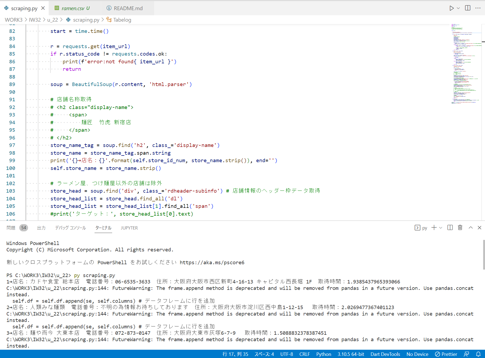

# DEMO

人気店のラーメンをPythonを使ってスクレイピングするプログラムです。

 
# Features
 
 人気店のラーメンをPythonを使ってスクレイピングするプログラムです。
 取得したラーメン店の情報はCSVファイルとして保存されます。


# Requirement
 
* Python 3.10.5
* beautifulsoup4 4.9.3
* pandas 1.3.3
 
# Installation
  
```bash

pip install beautifulsoup
pip install pandas
```
 
# Usage
 
```bash
git clone https://github.com/Mukkun07/Scraping.git
cd [ファイル名]
python scraping.py
```
 
# Note
 
 
# Author
 
* 作成者 Kenta Murakami
* 所属 HALOSAKA
 
# License
 
"Ramen Quest" is under [MIT license](https://en.wikipedia.org/wiki/MIT_License).

